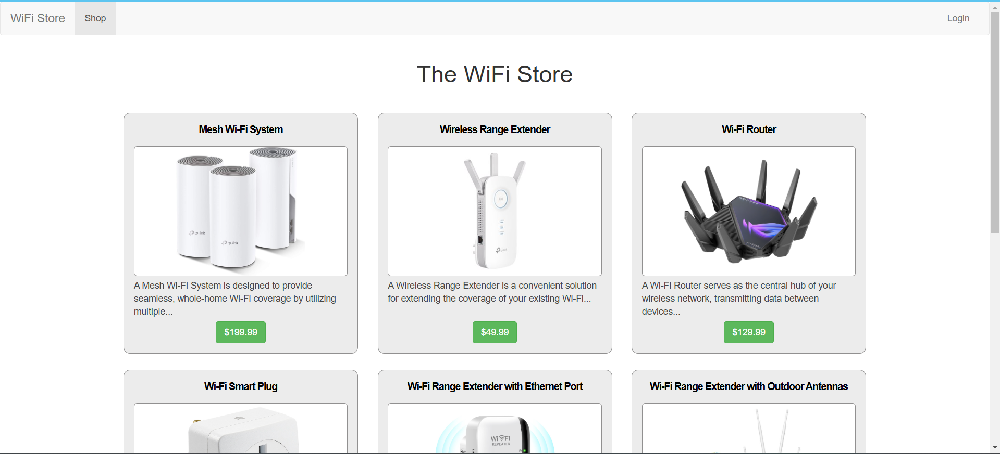

# Path to Exploiting IDOR

## Objective

The goal of this lab is to exploit an Insecure Direct Object Reference (IDOR) vulnerability to modify Adam's default address zip code to 12345 and capture the flag.

---

## Lab Details

- **Release Date**: February 28th, 2024
- **Difficulty**: Medium
- **URL**: 5cidkg85.eu1.ctfio.com
- **Username**: ben
- **Password**: password

---

## Walkthrough

### Step 1: Open the Target URL

Access the target URL provided in the lab details.



---

### Step 2: Login to the Application

Login using the provided credentials:

- **Username**: ben
- **Password**: password


---

### Step 3: Explore the Website Functionality

After logging in, examine the functionality of the website. Locate product 3 and note that it has a comment by Adam.L.


---

### Step 4: Access the Settings Page

Navigate to the settings page to view the address details.


---

### Step 5: Capture Login Request in Burp Suite

Use Burp Suite to inspect the login request and analyze the session data.


---

### Step 6: Examine Product 3's Request

Review the request for product 3 in Burp Suite to extract Adam.L's hash value:

```text
c833966c-636e-4c05-9e5e-08123b9c4795
```


---

### Step 7: Analyze Create Address Request

Review the request to create an address in Burp Suite. Take note of the parameters and structure.


---

### Step 8: Locate Default Address Parameter

Identify the default address parameter marked as `true` in the settings.


---

### Step 9: Capture Edit Address Request

Intercept the request to edit the address in Burp Suite for further modification.


---

### Step 10: Modify the Hash Using Intruder

Send the edit address request to Burp Suite's Intruder. Replace the hash associated with ben to Adam.L and use the sniper option to brute-force values from 0 to 10000.


---

### Step 11: Analyze the Response

Monitor the responses for a status code `200` with the message `"Address updated"`. This confirms the zip code has been successfully changed.


---

### Step 12: Capture the Flag

Confirm the modification was successful and capture the flag.


---

## Flag

```text
Change Adam's zipcode to 12345
```

---

## Tools and Techniques Used

- **Burp Suite**: Intercepting and modifying requests
- **Intruder**: Automating brute-force attacks
- **IDOR Exploitation**: Unauthorized access and manipulation of resources

---

## Lessons Learned

- Always validate user inputs and enforce proper access control.
- Avoid exposing sensitive identifiers in requests.
- Implement robust authentication and authorization mechanisms.
