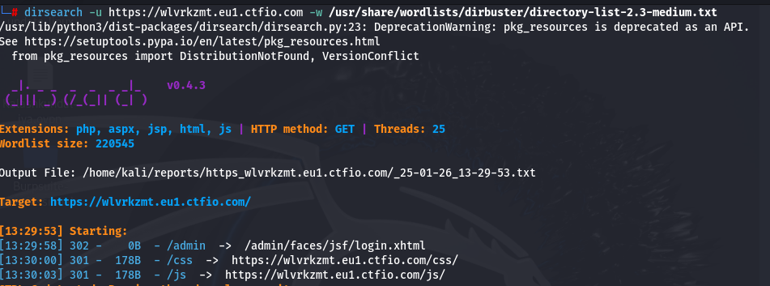

````markdown
# Path to RCE Walkthrough

## Objective

The goal of this lab is to discover a Remote Code Execution (RCE) vulnerability and retrieve the flag located in the `/flag.txt` file on the server's filesystem root.

---

## Lab Details

- **Difficulty**: Easy
- **Release Date**: January 17th, 2025
- **URL**: [https://5mnpbn0f.eu1.ctfio.com/admin/incident-report](https://5mnpbn0f.eu1.ctfio.com/admin/incident-report)

---

## Walkthrough

### Step 1: Directory Enumeration

Run `dirsearch` to enumerate directories and discover hidden paths on the server.  
Result: The `/admin` directory is found.

```bash
dirsearch -u https://5mnpbn0f.eu1.ctfio.com
```



---

### Step 2: Exploring the `/admin` Directory

Investigate the `/admin` path to find additional endpoints.  
Result: The `/admin/download` endpoint is discovered.


---

### Step 3: File Traversal Attack

Attempt path traversal to access sensitive files on the server.  
Result: Successfully retrieve `/admin/download?filename=/WEB-INF/web.xml`.


---

### Step 4: Accessing `/admin/incident-report`

The `/WEB-INF/web.xml` file reveals that `/admin/incident-report` can download log files.  
Result: The endpoint is identified for further exploitation.


---

### Step 5: Navigating to the Log Download

Navigate to the `/admin/incident-report` to download the log file.  
Result: The log file is automatically downloaded.


---

### Step 6: Decoding the Password Hash

Extract the encoded password hash from the downloaded log file.  
Use a decoding method to reveal the password.


---

### Step 7: Logging In

Login to the admin panel with the decoded password.  
Result: Successful login to the admin panel.


---

### Step 8: Executing Commands

Execute commands to interact with the server and enumerate available information.  
Result: Use commands like `print "id".execute().text` to retrieve user ID and `print "dir".execute().text` to list files.


---

### Step 9: Searching for the Flag

Locate the `flag.txt` file by inspecting the directory contents.  
Use the command `print "cat abcdflag.txt".execute().text` to read the flag.


---

## Flag

```text
flag{530deb6454d57b13c2089064d4f48f66}
```

---

## Tools and Techniques Used

- **dirsearch**: Directory brute-forcing
- **Path Traversal**: Exploiting file retrieval vulnerabilities
- **Hash Decoding**: Extracting credentials from logs
- **Command Execution**: Leveraging RCE to enumerate and retrieve sensitive files

---

## Lessons Learned

- Hidden directories and paths can provide critical access points.
- Logs often contain sensitive information, such as credentials.
- Proper server-side validation is crucial to avoid RCE vulnerabilities.

---
````
